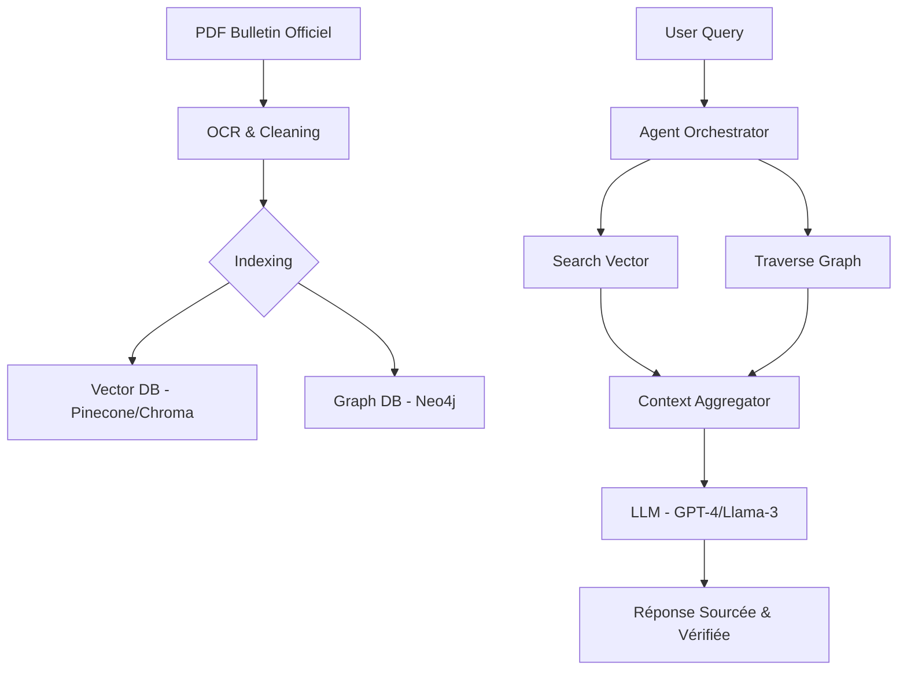

# 🏛️ Architecture RAG pour la Justice Marocaine

Ce document détaille les différentes couches du système de réponse aux questions (QA) que nous allons implémenter.

## 1. Les 3 Niveaux de RAG

### A. Naive RAG (Le Baseline)
- **Fonctionnement** : Découpage des lois en morceaux (chunks), stockage dans une base de données vectorielle (ChromaDB ou FAISS), et récupération par similarité cosinus.
- **Usage** : Questions simples sur le contenu d'un article spécifique.

### B. Graph RAG (La Structure)
- **Pourquoi ?** : Les lois marocaines sont interconnectées.
- **Fonctionnement** : Extraction des entités (Loi, Article, Décret, Date) et création de liens (nodes & edges) dans une base de données orientée graphe (Neo4j).
- **Usage** : "Quels sont les décrets qui modifient la loi sur le droit minier de 2015 ?"

### C. Agentic RAG (L'Intelligence)
- **Pourquoi ?** : Une recherche juridique nécessite souvent plusieurs étapes.
- **Fonctionnement** : Un agent (via LangGraph) reçoit la question et décide d'une stratégie :
    1. Reformuler la question (Query Rewriting).
    2. Chercher dans le Graphe pour les relations.
    3. Chercher dans la base Vectorielle pour le contexte sémantique.
    4. Synthétiser la réponse avec des citations précises.

## 2. Pipeline Technique

## 3. Choix Technologiques Recommandés

- **Embeddings** : `sentence-transformers/paraphrase-multilingual-MiniLM-L12-v2` (excellent pour le bilingue Arabe/Français).
- **Orchestration** : `LangChain` ou `LlamaIndex`.
- **Base de données** : `ChromaDB` (Local) pour le vectoriel, `NetworkX` ou `Neo4j` pour le graphe.
